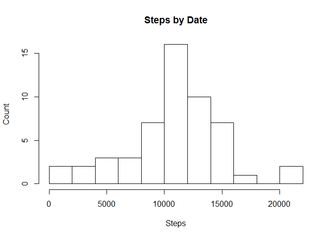
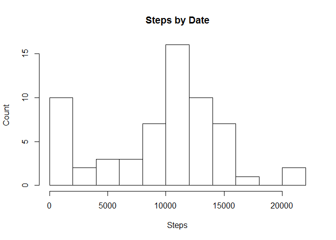
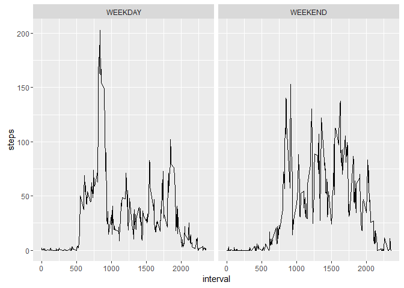

# Reproducible Week 2 - Assignment 

# Load Library

```r
library(ggplot2)
```


# File Location and URL


```r
data.dir <- "./data"
file.loc <- paste(data.dir, "activity.csv",sep = "/")
```


# One time file download and directory creation

```r
if (!file.exists(data.dir)) {
        dir.create(data.dir)
        source.file.url<-"https://d396qusza40orc.cloudfront.net/repdata%2Fdata%2Factivity.zip"        
        download.file(source.file.url, "source.zip",method = "curl")
        unzip(zipfile="source.zip",exdir = data.dir)
}
```

# 1.Code for reading in the dataset and/or processing the data

```r
# Read in data from file
data <- read.csv(file=file.loc,header = TRUE, na.strings = "NA")

# Column Type Conversation
data$date <- as.Date(data$date, "%Y-%m-%d")

# Check for total row count
# nrow(data) = 17568
```

# 2.Histogram of the total number of steps taken each day

```r
# Summary of steps by date
steps.by.date.sum <- with(data, aggregate(steps ~ date, FUN=sum))
hist(x = steps.by.date.sum$steps, breaks=10, ylab="Count", xlab="Steps", main = "Steps by Date")
```

<!-- -->


# 3.Mean and median number of steps taken each day

```r
median.steps.by.date <- median(data$steps, na.rm=T)
mean.steps.by.date <- mean(data$steps, na.rm=T)
print(paste("Median number of steps taken each day is: ", median.steps.by.date))
```

```
## [1] "Median number of steps taken each day is:  0"
```

```r
print(paste("Mean number of steps taken each day is: ", mean.steps.by.date))
```

```
## [1] "Mean number of steps taken each day is:  37.3825995807128"
```


# 4.Time series plot of the average number of steps taken

```r
steps.by.interval.mean <- with(data, aggregate(steps~interval, FUN=mean))
ggplot(steps.by.interval.mean,aes(interval, steps)) + geom_line()
```

<!-- -->

# 5.The 5-minute interval that, on average, contains the maximum number of steps

```r
print(steps.by.interval.mean[which.max(steps.by.interval.mean$steps),])
```

```
##     interval    steps
## 104      835 206.1698
```


# 6.Code to describe and show a strategy for imputing missing data


```r
## Profile the data set to understand quantum of missing data
table(is.na(data$steps))
```

```
## 
## FALSE  TRUE 
## 15264  2304
```

## Determine logics to impute missing value. In this example, I just impute with 0 for the variable

```r
data[is.na(data$steps),c("steps")] <- 0
```

# 7.Histogram of the total number of steps taken each day after missing values are imputed

```r
steps.by.date.sum <- with(data, aggregate(steps ~ date, FUN=sum))
hist(x = steps.by.date.sum$steps, breaks=10, ylab="Count", xlab="Steps", main = "Steps by Date")
```

<!-- -->

# 8.Panel plot comparing the average number of steps taken per 5-minute interval across weekdays and weekends

```r
data$weekend <- weekdays(data$date) %in% c("Saturday","Sunday")

data.weekend <-subset(data, weekend==TRUE)
data.weekday <-subset(data, weekend==FALSE)

data.weekend.mean <- aggregate(steps ~ interval, data.weekend, mean,na.rm=TRUE)
data.weekend.mean$weekend <- "WEEKEND"
data.weekday.mean <- aggregate(steps ~ interval, data.weekday, mean,na.rm=TRUE)
data.weekday.mean$weekend <- "WEEKDAY"

data.weekend.weekday <- rbind(data.weekend.mean, data.weekday.mean)


ggplot(data.weekend.weekday,aes(interval, steps)) + geom_line() + facet_grid(~weekend)
```

<!-- -->


# 9.All of the R code needed to reproduce the results (numbers, plots, etc.) in the report


